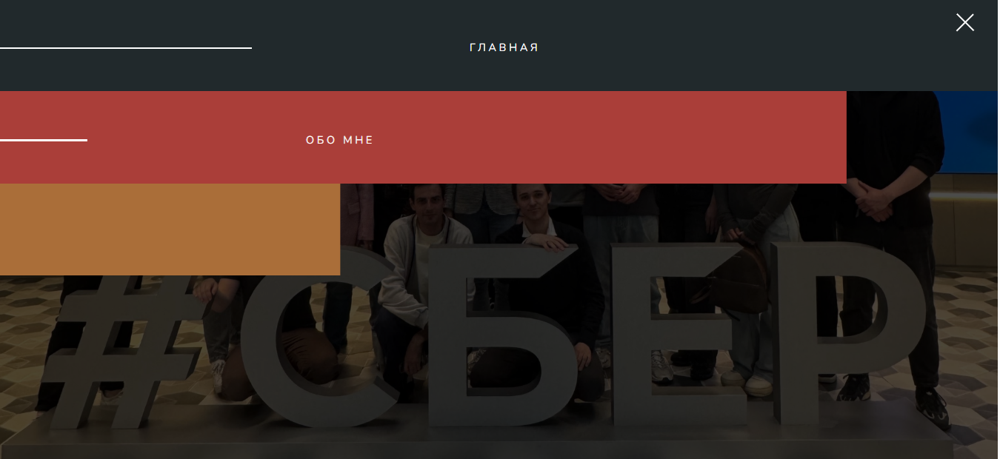
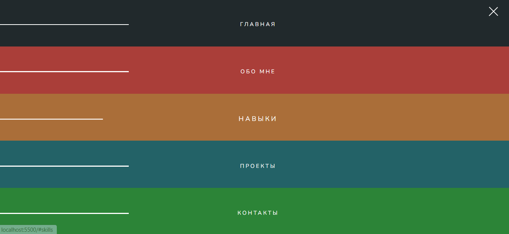

# animated-navigation hamburger menu (анимированная навигация через меню-гамбургер)
Описание: 
Навигация по страницам сайта выполнена с использованием продвинутой анимации CSS (реализовано через @keyframes) с использованием широко применяемого в мобильных приложениях и адаптивных веб-интерфейсах паттерна 'Три полоски' (Three-line icon). 
При нажатии на навигационную иконку навигационные элементы (список разделов сайта) появляются слева, причем появление организованно ступенчато с задержками по времени. В это же самое время также осуществляется анимация самой навигационной иконки (три полоски превращаются в крестик). При наведение на отображенный элемент навигации название раздела сайта увеличивается в размере и дополнительно, с помощью боковой линии, получает графический акцент. При нажатии на это название, пользователь переходит на соответстующую страницу сайта. При повторном нажатии на навигационную иконку, пользователь возвращается обратно на свою стартовую страницу. 
В CSS также используются переменные в псевдоклассе root для централизованного изменения цвета элементов навигации. 
Навигация полностью мобильно адаптируема (mobile responsible). 
**Навигация Hamburger menu:**
 
 
 